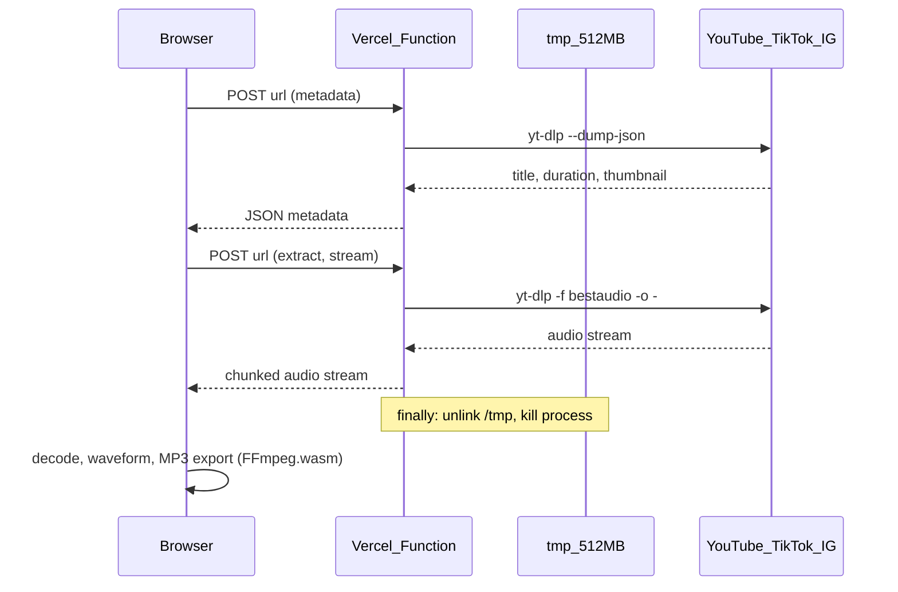

# ТЗ: Audio Extractor — извлечение аудио из видео-ссылок (`app/tools/audio-extractor/`)

## Контекст проекта

Новый инструмент QHub (qhub.kz) — Next.js App Router + TypeScript (strict) + Tailwind CSS, деплой на Vercel. Гибридная архитектура: **сервер эфемерно извлекает аудио по URL**, браузер строит waveform, воспроизводит и экспортирует MP3/WAV через FFmpeg.wasm (паттерны `app/tools/music-editor/`).

**Важно:** в отличие от большинства инструментов QHub, для разрешения ссылок YouTube/TikTok/Instagram **нужен серверный API**. Аудио **не хранится** на сервере — только in-memory / `/tmp` на время одного запроса, затем очистка.

---

## Архитектура

---

## 1. Поддерживаемые источники

| Платформа | URL | MVP |
|-----------|-----|-----|
| YouTube | `youtube.com/watch`, `youtu.be`, `youtube.com/shorts` | P0 |
| TikTok | `tiktok.com/.../video/`, `vm.tiktok.com` | P0 |
| Instagram | `/reel/`, `/p/` | P1 |

**Не в MVP:** приватные видео, live, плейлисты, stories.

---

## 2. UX

### 2.1. Главный экран
- Поле URL + «Извлечь»
- Legal disclaimer + чекбокс согласия (`sessionStorage`)
- Privacy-баннер: «Ссылка обрабатывается на сервере только на время запроса. Аудио не сохраняется.»

### 2.2. Метаданные
`POST /api/audio-extractor/metadata` → превью, название, автор, длительность, платформа.

### 2.3. Извлечение + предпросмотр
- Progress по bytes stream
- Waveform (800 peaks, canvas)
- Плеер: play/pause, seek, время

### 2.4. Экспорт
| Формат | По умолчанию |
|--------|--------------|
| MP3 320 kbps | **Да** |
| MP3 192 kbps | |
| WAV 16-bit | |

Экспорт — FFmpeg.wasm в браузере, без повторной отправки на сервер.

---

## 3. Лимиты

| Лимит | Значение |
|-------|----------|
| Hard max длительность | **600 сек (10 мин)** |
| Soft warning | > 300 сек (5 мин) |
| Max размер потока | **80 MB** |
| Rate limit | **10 извлечений / IP / час** |
| Max decoded в браузере | 100 MB |

---

## 4. API

### `POST /api/audio-extractor/metadata`
- Вход: `{ url: string }`
- Выход: `{ title, duration, thumbnail, platform, uploader, id }`
- `maxDuration`: 30

### `POST /api/audio-extractor/stream`
- Вход: `{ url: string }`
- Выход: `ReadableStream` audio
- `maxDuration`: 300
- Rate limit, whitelist URL, duration check

---

## 5. yt-dlp на Vercel

- Бинарник: `scripts/setup-ytdlp.mjs` → `bin/yt-dlp` на build
- Env: `YTDLP_PATH`, опционально `YTDLP_COOKIES` (Instagram)

---

## 6. i18n

ru / kk / en через `src/lib/audio-extractor/i18n.tsx`.

---

## 7. Юридический блок

- Личное некомmercial использование
- Ответственность пользователя за авторские права и ToS платформ
- QHub не хранит контент
- DRM не обходить

---

## 8. Принципиально отклонённое

- 100% client-only для URL
- Постоянное хранение на сервере (S3, DB)
- Плейлисты / batch URL
- PrivacyBanner «файлы не покидают устройство» (вводит в заблуждение)

---

## 9. Критерии приёмки

- [ ] YouTube/TikTok: metadata + extract + waveform + play
- [ ] MP3 320 kbps по умолчанию
- [ ] Видео >10 мин блокируется
- [ ] Rate limit на 11-м запросе/час
- [ ] Disclaimer перед первым extract
- [ ] `/tmp` очищается после запроса
